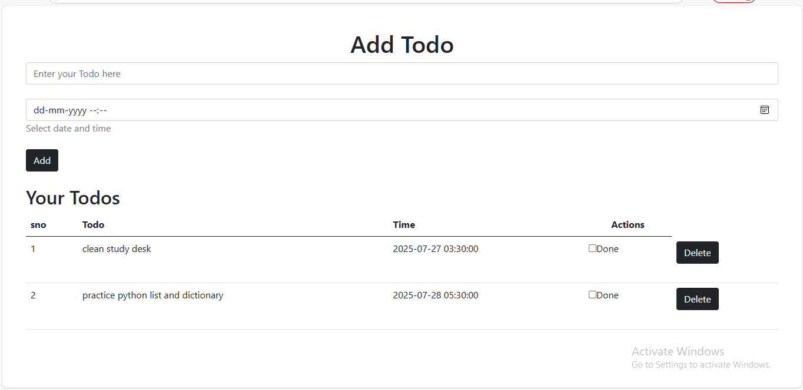
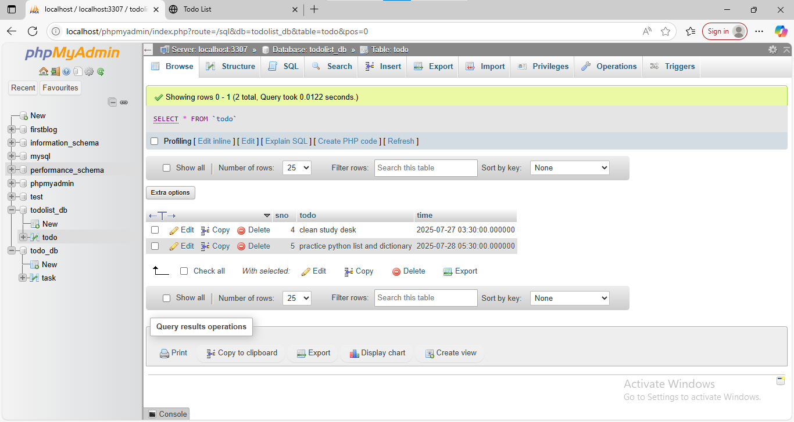

# 📝 Flask To-Do List App
This is a simple To-Do List web application built using *Python Flask* and a basic HTML template.  
It allows users to add and delete tasks with optional date and time.

---

## 📂 Files in this Repository

| File | Description |
|------|-------------|
| app.py | Flask application (backend logic) |
| ToDoList.html | HTML template using Jinja2 |
| screenshots/ | UI and database screenshots |

---

## 📸 Screenshots

| To-Do List UI | Database Table |
|---------------|----------------|
| |  |

> Screenshots show how the app looks and how the database stores the tasks.

---

## 💡 Features

- Add new tasks with title and time
- Delete tasks
- View all tasks in a table format
- Basic Bootstrap design (CDN used)
- Uses Jinja2 templating for dynamic content

---

## 🔧 Technologies Used

- Python (Flask)
- HTML (Jinja2 templating)
- Bootstrap 5 (via CDN)
- MySQL (for storing tasks) — Not included in this repo

---

## 🙋‍♀ Author

Created by *Ananya Singh*  
3rd Year BCA Student – University of Allahabad
---

## 📜 Note

This repository contains only the *HTML, **Python, and **screenshots* of the app for reference.  
Database setup and full project files are not included.
